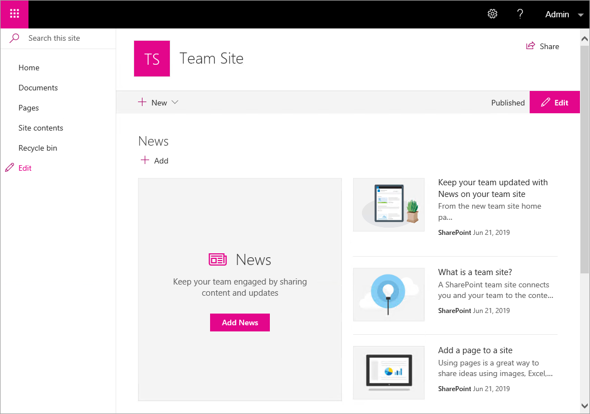
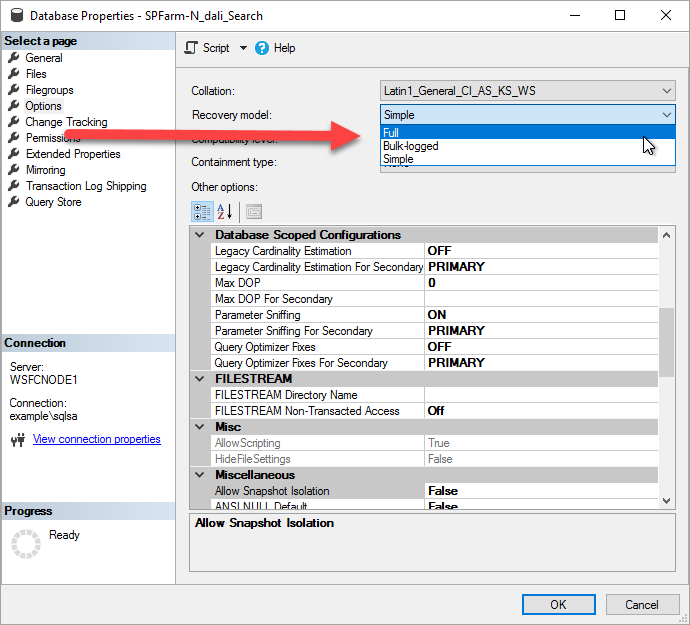
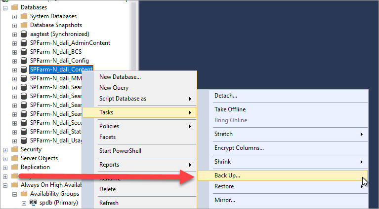
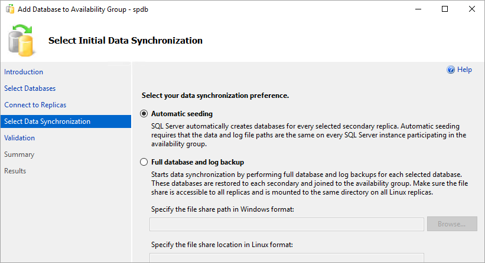
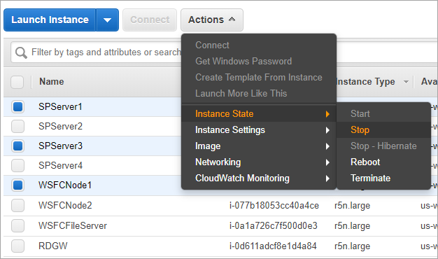
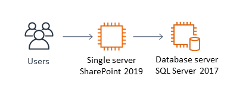
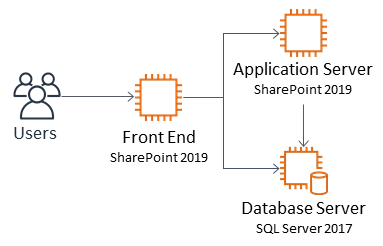
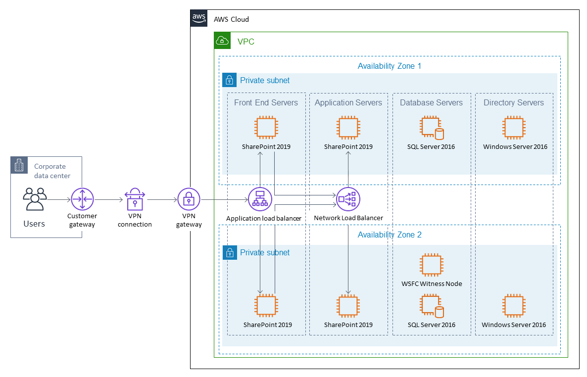
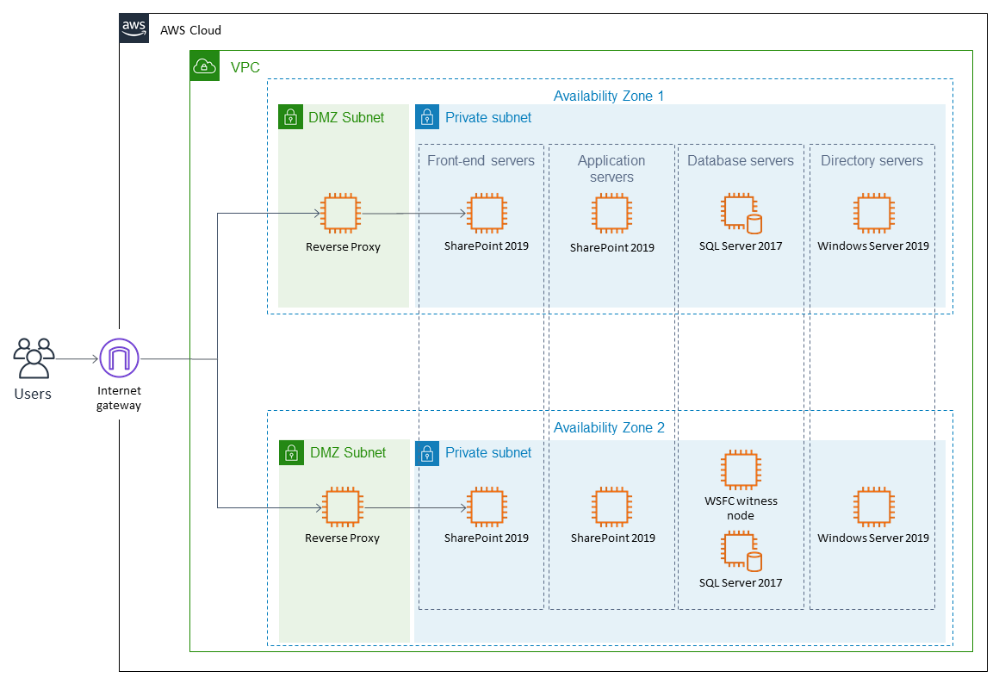

// Add steps as necessary for accessing the software, post-configuration, and testing. Don’t include full usage instructions for your software, but add links to your product documentation for that information.
//Should any sections not be applicable, remove them

== Post deployment steps
// If Post-deployment steps are required, add them here. If not, remove the heading

=== Create initial content

This step assumes that you deployed a SharePoint farm rather than a single server, and that the server name prefix value was SPServer. In this scenario, we’ll assume that the SharePoint farm is hosting an internal site, and we’ll set up a modern team site to validate our test.

After you have successfully launched the stack, create an RDP connection into the environment through one of the RD Gateway instances. You can retrieve the Elastic IP address for each RD Gateway instance from the Amazon EC2 console.

1.  Establish an RDP session to the primary SharePoint server (SPServer1 if you deployed a SharePoint farm with the default parameters, or SP if you deployed a single SharePoint server with the default parameters). From the start menu, select *SharePoint 2019 Central Administration*. When prompted to run this as an administrator, choose *OK* for this prompt. A web browser will open to *http://spadmin.example.com*. When prompted for credentials, use the domain admin user name and password.

2.  On the central administration home page, choose *Create site collections*.

[#PostDeploy1]
.Creating site collections
[link=images/image17.png]
image::../images/image17.png[PostDeploy1,image,width=283,height=151]

[start=3]
3.  Provide a *Title* for your site, and then choose the *Collaboration* tab and select the *team site* template.

[#PostDeploy2]
.Creating a team site
[link=images/image18.png]
image::../images/image18.png[PostDeploy2,image,width=648,height=562]

You will also need to define a *Primary Site Collection Administrator* on this page. You can use the domain administrator account for this value, or any other valid user in the domain. When you finish filling out the form, choose *OK*.

[start=4]
4.  Now that you have created a team site, navigate to *http://sharepoint.example.com*. When prompted for credentials, enter those of the user you selected as the site collection administrator in the step above. If the site loads, your SharePoint server is now ready for use.

[#PostDeploy3]
.The modern team site that was just created
[link=images/image19.png]

=== Make the SharePoint databases highly available

*Note* This step is not required if deploying the master stack into a new VPC.

[[enable-full-recovery-mode]]
=== Enable Full Recovery Mode

1.  Establish an RDP session to the WSFCNODE1 instance. Start SQL Server Management Studio, and then choose *Connect* to connect to the local server.

[#PostDeploy4]
.Connecting to WSFCNODE1
[link=images/image7.png]
image::../images/image7.png[PostDeploy4,image,width=477,height=315]

[start=2]
2.  For the four Search databases, and the Usage database, you will need to enable Full Recovery mode before you can add them to the availability group. In *Object Explorer*, expand the *Databases* node.
3.  For each database, choose the context (right-click) menu, and then choose *Properties*. In the *Database Properties* dialog box, choose the *Options* page, and then change *Recovery Model* to *Full*.

[#PostDeploy5]
.Setting databases to full recovery mode
[link=images/image20.png]

[[back-up-the-databases]]
=== Back Up the Databases

Next, make a backup of each SharePoint database. They will all share a common prefix that begins with the name of your CloudFormation stack.

1.  To make a backup, choose the context (right-click) menu for the database name, choose *Tasks*, and then choose *Back Up*.

[#PostDeploy6]
.Backing up a database
[link=images/image21.png]

[start=2]
2.  Keep the default settings, and then choose *OK* to perform the backup.

[[add-the-databases-to-the-availability-group]]
=== Add the Databases to the Availability Group

Now add these databases to the availability group that you prepared in link:#step-4.-prepare-the-sql-server-cluster-for-always-on-availability-groups[step 4].

1.  In *Object Explorer*, expand *Always On High Availability*, *Availability Groups*.
2.  Choose the context (right click) menu for the availability group, and choose *Add Database*.
+
[#PostDeploy7]
.Select Add Database for the availability group
[link=images/image22.png]
image::../images/image22.png[PostDeploy7,image,width=352,height=389]

3.  Select all the SharePoint databases to add to the group, and choose *Next*.
+
[#PostDeploy8]
.Selecting databases to include in the availability group
[link=images/image23.png]
image::../images/image23.png[PostDeploy8,image,width=648,height=589]

4.  Connect to WSFCNODE2 to allow the databases to be added to the group there, and then choose the *Connect* button, and choose *Next*.
5.  Choose *Automatic seeding* to tell SQL Server to automatically copy the databases to the replica.

[#PostDeploy9]
.Selecting automatic seeding to populate the secondary replicas
[link=images/image24.png]

[start=6]
6.  Ensure that the validation checks pass, and then choose *Next*, *Finish*.

[#PostDeploy10]
.Validation checks before adding the databases to the availability group
[link=images/image25.png]
image::../images/image25.png[PostDeploy10,image,width=648,height=260]

The databases are now part of the availability group.

[[provide-log-access-to-the-secondary-database-server]]
=== Provide Log Access to the Secondary Database Server

Now we need to ensure that the SharePoint service accounts have access to log in to the secondary database server if there is a failover event.

To do this, follow the instructions on the Microsoft https://support.microsoft.com/en-us/help/918992/how-to-transfer-logins-and-passwords-between-instances-of-sql-server[How to transfer logins and passwords between instances of SQL Server] support page. When you run the generated script against the secondary server, you might see some errors for accounts that already exist. This is normal. The script will, however, add the user logins that do not already exist on the secondary server. If you add additional server accounts or users at a later stage, be sure to run this script again to add them to the secondary server.

=== Enable multiple-subnet failover

Since the SharePoint databases are replicated across subnets, the last step is to tell SharePoint that multiple-subnet failover is required. To enable multiple-subnet failover for the SharePoint databases, on the *SPServer1* server, run Windows PowerShell with administrative permissions and execute the following PowerShell code.

Add-PSSnapin Microsoft.SharePoint.PowerShell

$dbs = Get-SPDatabase | ?\{$_.MultiSubnetFailover -ne $true}

foreach ($db in $dbs) \{

$db.MultiSubnetFailover = $true

$db.Update()

}

=== Test automatic failover

After your externally facing SharePoint site is available, you can test automatic failover. The primary database server should be the first WSFC node, the Network Load Balancer for the back end (central admin site) distributes HTTP requests across SPServer1 and SPServer2, and the Application Load Balancer for the front end distributes HTTP requests across SPServer3 and SPServer4. To verify that automatic failover is functional, on the Amazon EC2 console, forcibly stop the first WSFC node, SPServer1, and SPServer3. You can stop the instances simultaneously to perform this test, as shown in Figure 26.

[#PostDeploy11]
.Stopping the instances in Availability Zone 1
[link=images/image26.png]

After you simulate a failure by stopping the instances, the SharePoint databases should fail over automatically to the second WSFC node. The load balancers should detect that SPServer1 and SPServer3 have both gone offline and should direct HTTP traffic to SPServer2 and SPServer4, respectively. You can revisit the site and the central admin site in your web browser to confirm that everything is still working.

== Additional resources
//Provide any other information of interest to users, especially focusing on areas where AWS or cloud usage differs from on-premises usage.

=== Appendix A: Server Role Architecture

[[single-server-topology]]
==== Single-Server Topology

A single-server deployment of SharePoint 2019 is ideal for development environments and for small-scale testing of SharePoint where multiple servers might be excessive.

[#PostDeploy12]
.A single-server SharePoint topology
[link=images/image32.png]

In this topology, all SharePoint Service Apps and Instances will execute on the one server though, with no load balancing being required. The database server, however, runs on a different server than SharePoint. This is the simplest way to set up an environment for experimenting with SharePoint.

[[multiple-server-topology]]
==== Multiple-Server Topology

When you deploy SharePoint to support a production workload that will have many users across the organization, a single-server deployment is not robust enough to account for the load or to maintain availability in the event of an incident. The multiple-server template uses four SharePoint servers in to different roles to distribute the load.

[#PostDeploy13]
.An example of how multiple-server topologies in SharePoint can work
[link=images/image33.png]

In this model, many of the back-end related activities of a SharePoint farm are handled by a second application server (or group of servers) so that the front-end servers can focus on serving end-user requests. Both sets of SharePoint servers directly communicate with the database server or Always On availability group.

To simplify the configuration of multiple-server farms, SharePoint includes the MinRole feature. MinRole provides pre-defined roles, each of which runs a group of services, which ensures that the SharePoint farm runs more smoothly and is easier to maintain.

The multiple-server topology in this Quick Start leverages the following roles in MinRole:

* Front end: Front-End with Distributed Cache
* Application servers: Application with Search

This allows an even distribution of services while adhering to the Microsoft best practices for farm topology. for more information on what MinRole is and how it works in detail, including documentation on what services run on each of these roles, see https://docs.microsoft.com/en-us/sharepoint/install/overview-of-minrole-server-roles-in-sharepoint-server[Overview of MinRole Server Roles in SharePoint Servers 2016 and 2019].

With two servers in both roles (to support high availability), the resulting architecture is shown in the following diagram.

[#PostDeploy14]
.The multiple-server topology
[link=images/image34.png]
image::../images/image34.png[PostDeploy14,image,width=738,height=434]

To ensure the highest levels of availability, the servers are put in to different Availability Zones. This helps ensure that in an event where an entire Availability Zone becomes impaired, the servers in the second Availability Zone will still be running.

[[load-balancing]]
===== Load Balancing

The multiple-server version of the Quick Start deploys two load balancers. The first is an Application Load Balancer and is for the front-end servers, which run the main SharePoint web applications. The second is a Network Load Balancer and is for the application servers, where the central administration website runs.

The load balancers directs traffic to a healthy node in the target group. The load balancers poll for the availability of a connection on port 80 every 30 seconds. If a node fails three consecutive checks, the load balancer will not direct any requests to it until it is again registered as healthy.

[[database-tier]]
===== Database Tier

The database server role stores content and service data so that your SharePoint farm can utilize SQL Server in a number of ways. For small or medium-sized environments, you may be able to place all your databases on a single server. For larger-sized farms, you can spread your databases across multiple SQL Server instances or clusters of SQL Server instances. We recommend using SQL Server Enterprise in your SharePoint deployment, as it meets the performance, high availability, and reliability requirements for an enterprise application.

Amazon Machine Images (AMIs) for SQL Server Express, SQL Server Web Edition, and SQL Server Standard are available for launch on AWS. To install SQL Server 2016 or 2017 Enterprise Edition on AWS, you can use http://aws.amazon.com/windows/mslicensemobility/[Microsoft License Mobility through Software Assurance] to bring your own license into the cloud.

In the https://fwd.aws/GRNKR[Quick Start for Microsoft WSFC and SQL Server Always On on AWS], we provide an example of how you can deploy an Always On availability group to provide high availability for your databases. Our default SQL Server configuration uses the r4.2xlarge instance type, which is a memory-optimized instance with 8 vCPUs, 61 GiB of memory, and 1 x 100 GiB of SSD instance storage. Additionally, we provide highly performant and durable storage in the form of Elastic Block Store (Amazon EBS) volumes.

[[intranet-sharepoint-server-farm-on-aws]]
==== Intranet SharePoint Server Farm on AWS

All the architecture diagrams shown up to this point represent an isolated Microsoft SharePoint farm. For this scenario, users who are in the domain and network where SharePoint is running can access the content, but it is closed off to anyone outside of that domain and network. To allow access for a corporate network, the architecture needs to include private connectivity from the on-premises environment. Figure 36 shows a typical topology for an intranet SharePoint server farm running on the AWS Cloud.

[#PostDeploy15]
.The multiple-server topology
[link=images/image35.png]

As shown in Figure 35, we’ve added a VPN gateway to the VPC. To enable internal network connectivity to the VPC, we’ve created a VPN tunnel from the customer gateway (an IPsec-capable device) to the VPN gateway running in the VPC.

In addition, AWS offers the AWS Direct Connect service, which allows you to create a direct network connection from your data center into the AWS Cloud. In either case, once you have internal network connectivity into the VPC from your on-premises environment, you can simply provision internal Elastic Load Balancing to spread incoming traffic to front-end servers across each Availability Zone. Elastic Load Balancing will also provide high availability in the event of a server failure. If a web front-end server is unavailable, requests will be sent to one that is online.

[[security]]
==== Security

As with any enterprise application deployment, a Microsoft SharePoint Server farm on AWS should implement strict security controls. AWS provides a comprehensive set of security features that allow you to control the flow of traffic through your VPC, associated subnets, and ultimately to each Amazon EC2 instance. These features allow you to reduce the attack surface of your environment while providing both end-user access to SharePoint content and applications, and administrator access for securely managing the Windows Server infrastructure. These security features and approaches are covered in this section.

[[security-groups]]
===== Security Groups

When launched, Amazon EC2 instances must be associated with at least one security group, which acts as a stateful firewall. You have complete control over the network traffic entering or leaving your security groups, and you can build granular rules that are scoped by protocol, port number, and source/destination IP address or subnet. By default, all traffic egressing a security group is permitted. Ingress traffic, on the other hand, must be configured to allow the appropriate traffic to reach your instances.

The https://d0.awsstatic.com/whitepapers/aws-microsoft-platform-security.pdf[Securing the Microsoft Platform on Amazon Web Services] whitepaper discusses the different methods for securing your AWS infrastructure in detail. Recommendations include providing isolation between application tiers using security groups. We recommend that you tightly control ingress traffic in order to reduce the attack surface of your Amazon EC2 instances.

[[network-acls]]
===== Network ACLs

A network access control list (ACL) is a set of permissions that can be attached to any network subnet in a VPC to provide stateless filtering of traffic. Network ACLs can be used for inbound or outbound traffic, and provide an effective way to blacklist a CIDR block or individual IP addresses. These ACLs can contain ordered rules to allow or deny traffic based upon IP protocol, service port, or source or destination IP address. Figure 36 shows the default ACL configuration for a VPC subnet.

[#PostDeploy16]
.Default network ACL configuration for a VPC subnet
[link=images/image36.png]
image::../images/image36.png[PostDeploy16,image,width=597,height=281]

You may choose to keep the default network ACL configuration or lock it down with more specific rules to restrict traffic between subnets at the network level. Typically, network ACLs will mirror your security group rules. One benefit of multiple layers of network security (security groups and network ACLs) is that each layer can be managed by a separate group in your organization. If a server administrator inadvertently exposes unnecessary network ports on a security group, a network administrator could supersede this configuration by blocking that traffic at the network ACL layer.

[[secure-extranet-publishing]]
===== Secure Extranet Publishing

Some organizations may use SharePoint Server to host a publicly accessible extranet. In this scenario, you can add another layer of security by placing reverse proxy servers into your public subnet to provide additional security and threat management. In this configuration, the public subnet acts like the DMZ that you would typically use in a physical network environment. Web page requests from internet-based users would be sent to these reverse proxy servers, which would then establish a connection to your web front-end servers that are running in a private subnet.

Figure 37 shows an example of publishing SharePoint web front-end servers, located in a private subnet, through a reverse proxy server deployed into a public subnet.

[#PostDeploy17]
.Web application publishing with a reverse proxy server
[link=images/image37.png]

A benefit of this architecture is that it provides the ability to pre-authenticate users at the perimeter of your network while shielding your internal SharePoint servers from the public internet. Several third-party appliances and applications can be used for this task. Microsoft’s Web Application Proxy role in Windows Server 2019 also provides support for publishing your SharePoint resources to the internet.

The AWS CloudFormation template provided by this Quick Start does not set up an environment for extranet publishing, but after the deployment, you may choose to add reverse proxy servers and configure the environment that’s illustrated in Figure 38.

[[ec2-instance-types]]
==== EC2 Instance Types

Properly planning for capacity and sizing servers is a key aspect of every enterprise application deployment. As such, it is important that you choose the appropriate Amazon EC2 instance type for each server role in your Microsoft SharePoint deployment. Since each deployment is different, you will need to follow Microsoft’s detailed guidance on how to properly size your environment based on the number of users and workloads involved. As a starting point, consider the minimum requirements for each server role.

The following values are based on minimum requirements for all server roles operating in a three-tier farm.

[cols=",,,",options="header",]
|=================================================================================
|Role |Processor |RAM |Boot volume
|Web front-end server / front-end server |64-bit, 4 cores |12 GiB |80 GiB
|Application server / batch processing / back end |64-bit, 4 cores |12 GiB |80 GiB
|Database server (fewer than 1,000 users) |64-bit, 4 cores |8 GiB |80 GiB
|Database server (between 1,000 and 10,000 users) |64-bit, 8 cores |16 GiB |80 GiB
|=================================================================================

The Quick Start uses the following instance types by default. These provide additional capacity over the absolute minimum requirements as a starting point.

[cols=",,",options="header",]
|======================================================================================================
|Role |EC2 instance type |Boot volume
|Web front-end server / front-end server |m4.xlarge (4 vCPU, 16 GiB memory) |100 GiB (EBS/GP2)
|Application server / batch processing / back end |m4.xlarge (4 vCPU, 16 GiB memory) |100 GiB (EBS/GP2)
|Database server |r4.2xlarge (8 vCPU, 61 GiB memory) |100 GiB (EBS/GP2)
|======================================================================================================

Amazon Elastic Block Store (Amazon EBS) volumes are used as the boot volume for each instance. Notice that we use the EBS General Purpose (gp2) volume type. This is an SSD-backed EBS volume that is used as the default boot volume type for all EC2 instances. These gp2 volumes provide a consistent baseline of 3 IOPS/GiB and are burstable up to 3,000 IOPS.

When you launch the AWS CloudFormation template in this guide, you’ll be given the opportunity to adjust these instance types.[[_Customize_Your_Topology]]

=== AWS services

* AWS CloudFormation +
https://aws.amazon.com/documentation/cloudformation/
* Amazon EC2 +
https://docs.aws.amazon.com/AWSEC2/latest/WindowsGuide/
* Amazon VPC +
https://aws.amazon.com/documentation/vpc/
* AWS Systems Manager +
https://aws.amazon.com/systems-manager/

*Microsoft SharePoint Server*

* Configure SQL Server AlwaysOn Availability Groups for SharePoint Server +
https://docs.microsoft.com/en-us/sharepoint/administration/configure-an-alwayson-availability-group
* Failover Clustering and Always On Availability Groups (SQL Server) +
https://docs.microsoft.com/en-us/sql/database-engine/availability-groups/windows/failover-clustering-and-always-on-availability-groups-sql-server?view=sql-server-2017

*Deploying Microsoft software on AWS*

* Microsoft on AWS +
https://aws.amazon.com/microsoft/
* Securing the Microsoft Platform on Amazon Web Services +
https://d1.awsstatic.com/whitepapers/aws-microsoft-platform-security.pdf
* Microsoft Licensing Mobility +
https://aws.amazon.com/windows/mslicensemobility/
* MSDN on AWS +
https://aws.amazon.com/windows/msdn/
* Windows and .NET Developer Center on AWS +
https://aws.amazon.com/net/

*Quick Start reference deployments*

* AWS Quick Start home page +
https://aws.amazon.com/quickstart/
* Microsoft Active Directory on AWS +
https://docs.aws.amazon.com/quickstart/latest/active-directory-ds/
* Microsoft Remote Desktop Gateway on AWS +
https://docs.aws.amazon.com/quickstart/latest/rd-gateway/
* Microsoft SQL Server with WSFC on AWS +
https://docs.aws.amazon.com/quickstart/latest/sql/