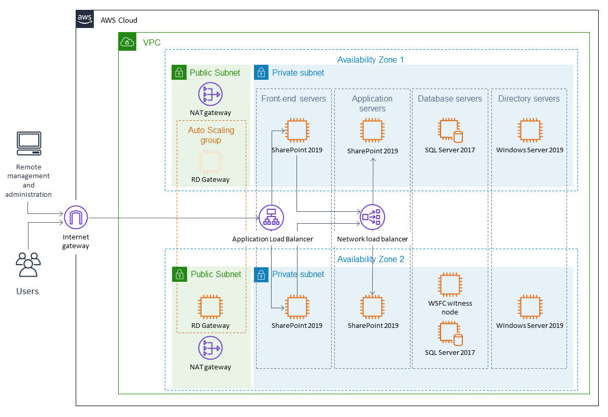
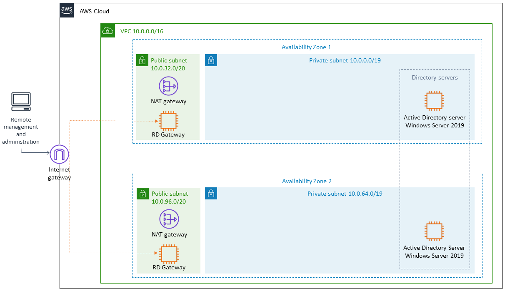
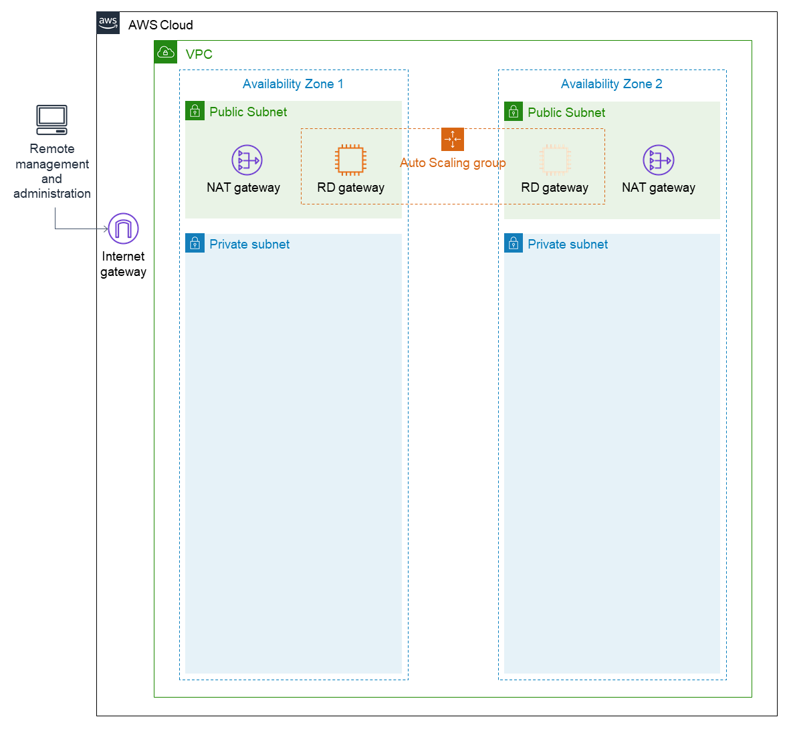

There are a number of ways to design the topology of your SharePoint farm depending on your requirements. In SharePoint 2016, Microsoft added a feature called MinRole, which helped simplify deployment, performance, and reliability of SharePoint farms. This approach is used for the multiple-server AWS CloudFormation template provided by this Quick Start. (The single-server option is deployed as a custom role so that it can run more services on its own.) Both the multiple-server and single-server topologies are covered in detail later in this guide.

Deploying this Quick Start for a new virtual private cloud (VPC) with
default parameters builds the following {partner-product-short-name} environment in the AWS Cloud.

// Replace this example diagram with your own. Send us your source PowerPoint file. Be sure to follow our guidelines here : http://(we should include these points on our contributors guide)
:xrefstyle: short
[#architecture1]
.Quick Start architecture for {partner-product-short-name} on AWS
[link=images/architecture_diagram.png]

As shown in <<architecture1>>, the Quick Start sets up the following:

* A highly available architecture that spans two Availability Zones.*
* A VPC configured with public and private subnets, according to AWS
best practices, to provide you with your own virtual network on AWS.*

In the public subnets:

* Managed network address translation (NAT) gateways to allow outbound
internet access for resources in the private subnets.*
* A Remote Desktop Gateway (RD Gateway) in an Auto Scaling group to allow Remote Desktop Protocol (RDP) access to Amazon Elastic Compute Cloud (Amazon EC2) instances in public and private subnets.*

In the private subnets:
// Add bullet points for any additional components that are included in the deployment. Make sure that the additional components are also represented in the architecture diagram.

* Two Amazon EC2 instances serving as Microsoft Active Directory domain controllers.
* Two Amazon EC2 instances serving as Microsoft SQL servers in a highly-available cluster.
* An Amazon EC2 instance serving as a Windows failover clustering file share witness.
* Two Amazon EC2 instances serving as Microsoft SharePoint application servers.
* Two Amazon EC2 instances serving as Microsoft SharePoint front-end servers.
* A network load balancer for the SharePoint application servers.
* An Application Load Balancer for the SharePoint front-end servers.

*The template that deploys the Quick Start into an existing VPC skips
the components marked by asterisks and prompts you for your existing VPC
configuration.

The AWS CloudFormation templates provided with this Quick Start deploy the SharePoint servers shown in <<architecture1>>. Active Directory and SQL Server are deployed via their corresponding Quick Starts. See the link:#deployment-steps[Deployment Steps] section for more details. The template deploys a highly available architecture that includes redundant servers for SharePoint Server 2019 in two Availability Zones.

The following sections describe these components of the architecture in more detail. For more information about the server role architecture, including a detailed discussion of multiple-server and single-server topologies, see link:#appendix-a-server-role-architecture[Appendix A].

[[vpc-configuration]]
=== VPC configuration

When deploying a Windows-based architecture on the AWS Cloud, we recommend a VPC configuration that supports the following requirements:

* Critical workloads should be placed in a minimum of two Availability Zones to provide high availability.
* Internal application servers and other non-internet facing servers should be placed in private subnets to prevent direct access to these instances from the internet.
* RD Gateways should be deployed into public subnets in each Availability Zone for remote administration. Other components, such as reverse proxy servers, can also be placed into these public subnets if needed.

For details on the VPC design used in this reference, see the https://fwd.aws/N6e7B[Active Directory Domain Services Quick Start deployment guide].

Based on these best practices, the VPC Quick Start deploys the following base-level VPC framework to support the SharePoint Server 2019 infrastructure:

:xrefstyle: short
[#architecture2]
.VPC architecture on the AWS cloud
[link=images/image3.png]
image::../images/image3.png[Architecture2,image,width=648,height=427]

As shown in <<architecture2>>, NAT gateways are deployed into the public subnets. The public subnets have a route to the internet directly through the internet gateway attached to the VPC.

Instances that will be deployed in the private subnets have no direct route to the internet. Instead, instances in private subnets use private routes to send internet traffic to the NAT gateways in the public subnets. This architecture isolates your critical workloads from direct internet access.

[[active-directory-domain-services]]
=== Active Directory Domain Services

To provide user authentication and authorization, the Microsoft SharePoint servers in this reference architecture use Active Directory Domain Services (Active Directory DS). As you deploy your environment, you should place at least one domain controller in a private subnet in each Availability Zone for redundancy and high availability.

[#architecture3]
.Domain controllers in each Availability Zone
[link=images/image4.png]

Notice that in <<architecture3>>, we’ve now included a domain controller in the Active Directory tier in each Availability Zone.

There are two ways to use Active Directory DS in the AWS Cloud:

* Cloud only – This is the architecture shown in <<architecture3>>. This type of architecture means that your entire Active Directory forest exists only within the AWS Cloud. With a cloud-only Active Directory DS architecture, there are no on-premises domain controllers.
* Hybrid – The hybrid architecture takes advantage of your existing Active Directory DS environment. You can extend your private, on-premises network to AWS so the resources in the cloud can utilize your existing Active Directory infrastructure. In a hybrid architecture, we recommend that you also deploy domain controllers for your existing Active Directory forest to the AWS Cloud. We recommend this configuration primarily to help ensure that the application servers deployed in AWS remain functional and available in the event of an on-premises outage.

The https://fwd.aws/N6e7B[Quick Start for Active Directory Domain Services on the AWS Cloud] covers our best practices and recommendations for deploying Active Directory DS on AWS. The process outlined in this SharePoint Quick Start asks you to launches the Active Directory DS Quick Start, which deploys the Active Directory environment based on those best practices.

[[remote-administration]]
=== Remote administration

As we design the architecture for a highly available SharePoint farm, we should also design for highly available and secure remote access. We can do this by deploying an RD Gateway in each Availability Zone. In the case of an Availability Zone outage, this architecture allows access to the resources that may have failed over to the other Availability Zone.

The RD Gateway uses the Remote Desktop Protocol (RDP) over HTTPS to establish a secure, encrypted connection between remote administrators on the internet and Windows-based EC2 instances, without needing to configure a virtual private network (VPN) connection. This allows you to reduce the attack surface on your Windows-based instances while providing a remote administration solution for administrators.

[#architecture4]
.NAT gateways and Remote Desktop Gateways in public subnets
[link=images/image5.png]

The AWS CloudFormation templates provided in this Quick Start automatically deploy the architecture described in https://fwd.aws/5VrKP[Remote Desktop Gateway on the AWS Cloud: Quick Start Reference Deployment]. After you have launched your SharePoint infrastructure using a deployment option in this guide, you will initially connect to your instances using a standard RDP TCP port 3389 connection. You can then follow the steps in the guide to secure future connections via HTTPS.

