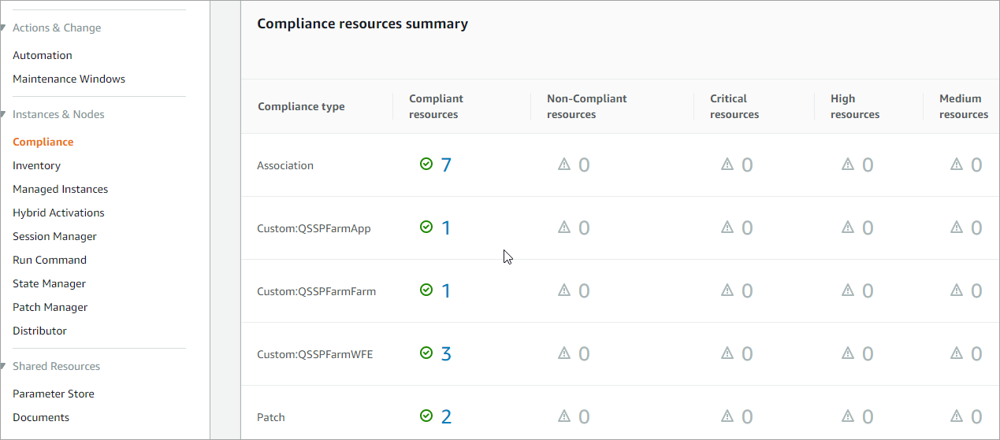
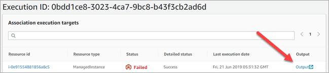

// Add any tips or answers to anticipated questions. This could include the following troubleshooting information. If you don’t have any other Q&A to add, change “FAQ” to “Troubleshooting.”

== FAQ

*Q.* I encountered a *CREATE_FAILED* error when I launched the Quick Start.

*A.* If AWS CloudFormation fails to create the stack, we recommend that you relaunch the template with *Rollback on failure* set to *Disabled*. (This setting is under *Advanced* in the AWS CloudFormation console, *Options* page.) With this setting, the stack’s state is retained and the instance is left running, so you can troubleshoot the issue. (For Windows, look at the log files in %ProgramFiles%\Amazon\EC2ConfigService and C:\cfn\log.)
// If you’re deploying on Linux instances, provide the location for log files on Linux, or omit this sentence.

WARNING: When you set *Rollback on failure* to *Disabled*, you continue to incur AWS charges for this stack. Please make sure to delete the stack when you finish troubleshooting.

The following table lists specific CREATE_FAILED error messages you might encounter while creating the stack in AWS CloudFormation.

[cols=",,",options="header",]
|===========================================================================================================================================================================================================================================================================================================================================================================================================================================================================================
|Error message |Possible cause |What to do
|API: ec2: RunInstances Not authorized for images: https://forums.aws.amazon.com/[_ami-ID_] |The template is referencing an AMI that has expired. a|
We refresh AMIs on a regular basis, but our schedule isn’t always synchronized with AWS AMI updates. If you get this error message, notify us, and we’ll update the template with the new AMI ID.

If you’d like to fix the template yourself, you can https://fwd.aws/87Dgp[download it] and update the Mappings section with the latest AMI ID for your Region.

|We currently do not have sufficient _instance-type_ capacity in the AZ you requested |One of the instance types is currently not available. |Switch to an instance type that supports higher capacity, or complete the *Request quota increase* form on the https://console.aws.amazon.com/servicequotas/home?region=us-east-1#!/[Service Quotas] console to increase the Amazon EC2 quota for the instance type or Region. Quota increases are tied to the Region they were requested for.
|Instance _ID_ did not stabilize |You have exceeded your IOPS for the Region. |https://aws.amazon.com/support/createCase?serviceLimitIncreaseType=ebs-volumes&type=service_limit_increase[Request a quota increase] by completing the *Request quota increase* form on https://console.aws.amazon.com/servicequotas/home?region=us-east-1#!/[Service Quotas] console.
|System Administrator password must contain at least 8 characters |The master password contains $ or other special characters. a|
Check the password parameters before you re-launch the Quick Start.

The passwords must be at least 8 characters, consisting of uppercase and lowercase letters and numbers. Follow the https://technet.microsoft.com/en-us/library/hh994562.aspx[guidelines for complex passwords], and avoid using special characters such as @ or $.

|===========================================================================================================================================================================================================================================================================================================================================================================================================================================================================================

For additional information, see https://docs.aws.amazon.com/AWSCloudFormation/latest/UserGuide/troubleshooting.html[Troubleshooting AWS CloudFormation^] on the AWS website.

*Q.* I encountered a size limitation error when I deployed the AWS CloudFormation templates.

*A.* We recommend that you launch the Quick Start templates from the links in this guide or from another S3 bucket. If you deploy the templates from a local copy on your computer or from a location other than an S3 bucket, you might encounter template size limitations. For more information, see http://docs.aws.amazon.com/AWSCloudFormation/latest/UserGuide/cloudformation-limits.html[AWS CloudFormation quotas^].

== Troubleshooting

If failure is signaled or a wait condition or resource signal times out, review the configuration attempts in AWS Systems Manager State Manager.

. On the Systems Manager console, choose *Compliance*.

You will see a list of all State Manager compliance resources.

[#Troubleshooting1]
.Compliance view in Systems Manager
[link=images/image27.png]

[start=2]
. Look for one of the following compliance types and identify whether there are non-compliant resources for it:

a.  Single-server deployments will see *Custom:QSSPSingle*.

b.  Multiple-server deployments will see *Custom:QSSPFarmFarm*, *Custom:QSSPFarmApp*, and *Custom:QSSPFarmWFE*.

[start=3]
. If there are non-compliant resources, choose the number with the red X next to it, and scroll down the page to see a list of instances that do not meet the compliance requirement. (This occurs when the server could not be configured correctly.)
. Select the instance you want to investigate. A new browser tab will open.
. To see which resources on the server were not configured, on the instance detail page, on the *Configuration compliance* tab, choose *Configuration status* in the filter box, and then choose *NonCompliant*.

[#Troubleshooting2]
.Filtering to show non-compliant resources
[link=images/image28.png]
image::../images/image28.png[Troubleshooting2,image,width=648,height=261]

[start=6]
. To find detailed logs, on the *Associations* tab, choose the entry with the *AWS-ApplyDSCMofs* document name, and then choose *View Output*. Take note of the association ID here, which is needed in the next step.

[#Troubleshooting3]
.Finding the association ID
[link=images/image29.png]
image::../images/image29.png[Troubleshooting3,image,width=648,height=160]

[start=7]
. On the Systems Manager console, choose *State Manager*.

[#Troubleshooting4]
.Filtering to show non-compliant resources
[link=images/image30.png]
image::../images/image30.png[Troubleshooting4,image,width=648,height=473]

[start=8]
. In the list that is displayed, choose the association ID from step 6 to view its execution history.
. On the *Execution History* tab, you can see every configuration run that has been attempted by this Automation document (State Manager configurations run every 30 minutes). Select the first item in the list, and then find the instance ID that was failing configuration.
. Choose *Output*.

[#Troubleshooting5]
.The output link for a specific execution job
[link=images/image31.png]

A new browser tab will open.

[start=11]
. The console will show only the first 2,500 characters from the log, which is not likely to be useful. To view the logs, choose *Amazon S3*, select the RunPowerShell folder, and open the file stdout. The file will show you the full output of the configuration script, including any errors, which will help you troubleshoot.

For additional information, see http://docs.aws.amazon.com/AWSCloudFormation/latest/UserGuide/troubleshooting.html[Troubleshooting AWS CloudFormation] on the AWS website.